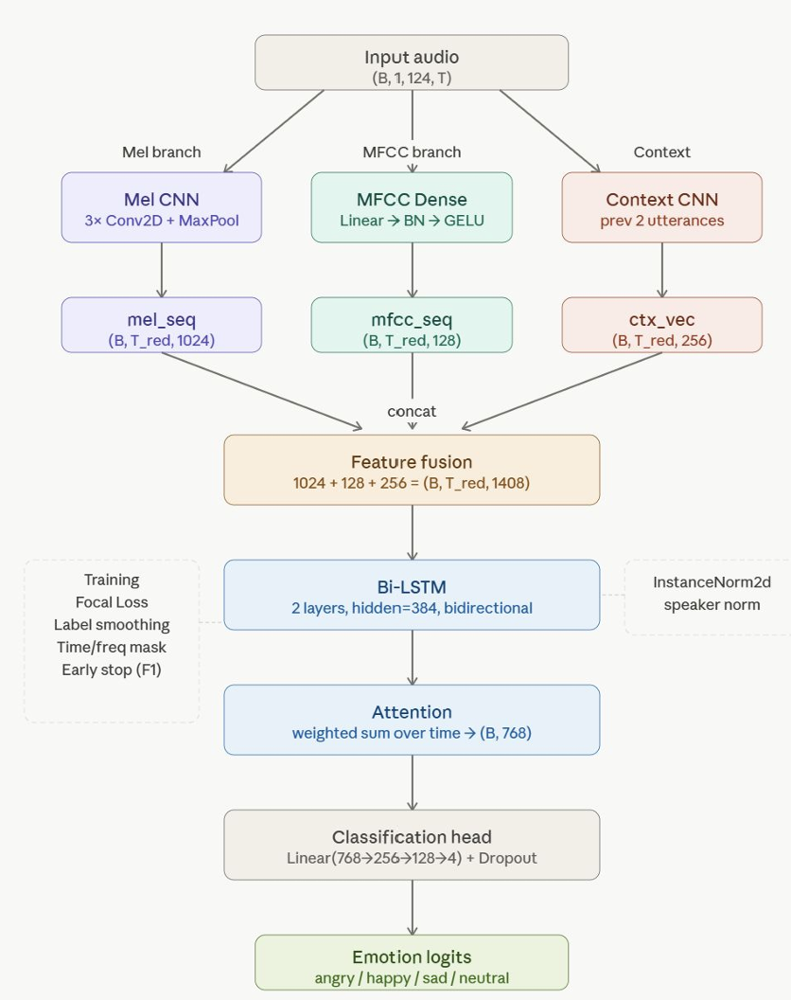
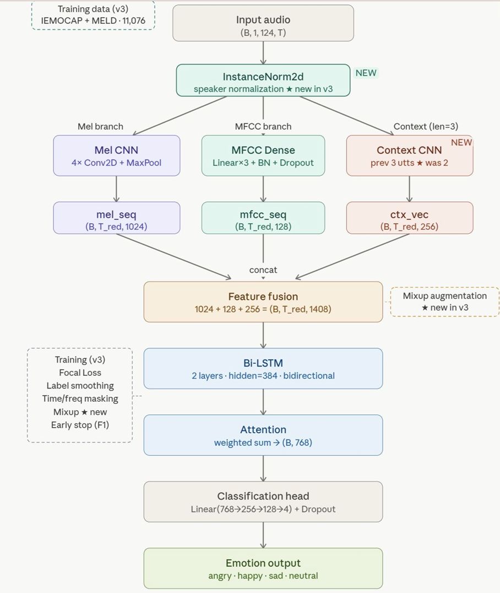
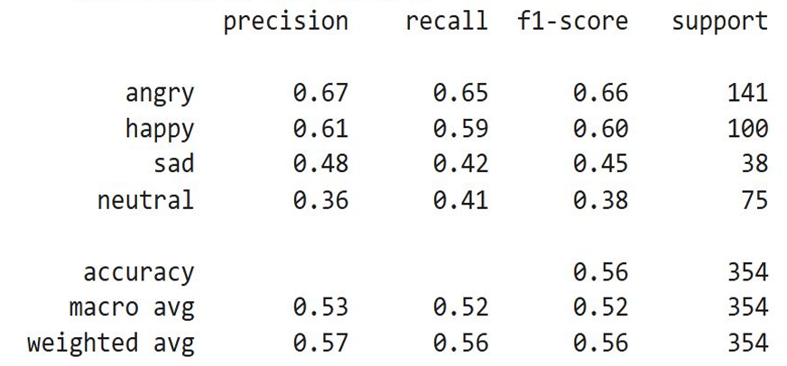

# DualBranchSER — Speech Emotion Recognition

> **Team Course Project** — SJSU DATA 255 Deep Learning · Group 2 · April 2026  
> **My Contribution:** Model optimization, Focal Loss implementation, data augmentation, and multi-utterance Dialogue Context module with InstanceNorm2d speaker normalization.


---

## Overview

DualBranchSER is a lightweight dual-branch CNN + Bi-LSTM architecture for real-time Speech Emotion Recognition (SER). It simultaneously extracts spatial features from Log-Mel Spectrograms and temporal features from MFCC coefficients, augmented by a dialogue-level Context Encoder that captures emotional continuity across a conversation.

**Key Results vs Baselines (no pretrained weights):**

| Model | Accuracy | Macro-F1 | RTF |
|---|---|---|---|
| MFCC + MLP (Baseline) | 40.1% | 38.6% | 0.00013 |
| Transformer / wav2vec (Baseline) | 45.5% | 43.7% | 0.00005 |
| **DualBranchSER (Ours)** | **55.9%** | **52.4%** | **0.00008** |
| DualBranchSER-v3 (Ours) | 54.5% | 50.5% | 0.00008 |

**+15.8% accuracy over MFCC+MLP baseline · Real-time capable (RTF=0.00008)**

---

## System Architecture

### DualBranchSER (V2 — Best Model)


### DualBranchSER-v3 (Extended)


---

## Three-Branch Design

**Branch 1 — Mel CNN**
- 3-block 2D CNN on Log-Mel Spectrogram (64 mel bands)
- Captures pitch patterns, spectral textures, emotional arousal cues
- Output: (B, T_red, 1024)

**Branch 2 — MFCC Dense**
- Dense layers on 20 MFCC coefficients + delta + delta-delta (60 channels)
- Captures prosodic features: speaking rate, intonation, voice quality
- Output: (B, T_red, 128)

**Branch 3 — Context Encoder**
- Encodes previous 2-3 utterances to capture conversational emotional history
- Addresses vanishing cue problem in long dialogues
- Output: (B, T_red, 256)

**Fusion → Bi-LSTM + Attention → Classification Head (4 emotions)**

---

## Key Innovations

| Problem | Our Solution |
|---|---|
| CNNs treat audio as static image | Bi-LSTM + Attention models temporal dynamics |
| No conversational context | Dialogue Context module (prev 2-3 utterances) |
| Class imbalance (neutral ignored) | Focal Loss + class weights → neutral F1: 0.00→0.38 |
| Speaker variability | InstanceNorm2d removes speaker-specific tone (v3) |
| SOTA models too heavy | Lightweight design, RTF=0.00008, no pretraining |

---

## Dataset

| Dataset | Size | Classes | Use |
|---|---|---|---|
| IEMOCAP | 2,831 train / 354 val / 354 test | angry, happy, sad, neutral | Primary benchmark |
| MELD | 10,494 samples | 4-class subset | v3 cross-domain experiment |

---

## Results

### Per-Class Performance (DualBranchSER V2)



| Class | Precision | Recall | F1 |
|---|---|---|---|
| Angry | 0.67 | 0.65 | 0.66 |
| Happy | 0.61 | 0.59 | 0.60 |
| Sad | 0.48 | 0.42 | 0.45 |
| Neutral | 0.36 | 0.41 | 0.38 |

---

## Training

- **Loss:** Focal Loss (weight 0.6) + Label-smoothed cross-entropy (weight 0.4)
- **Optimizer:** AdamW (lr=1e-4, weight_decay=1e-4)
- **Scheduler:** CosineAnnealingWarmRestarts
- **Early Stopping:** Monitors Macro-F1 (patience=10)
- **Augmentation:** Time masking, frequency masking, Gaussian noise

---

## Setup

```bash
pip install torch torchaudio librosa numpy pandas scikit-learn
```

---

## Team & Contributions

| Member | Role |
|---|---|
| Abhinita Sanabada | Data & Feature Engineering |
| Arya Mehta | Core Branch Architecture |
| Anshika Goel | Sequence Modeling & Fusion |
| **Jane Heng** | **Optimization, Focal Loss, Data Augmentation, Dialogue Context Module** |

---

## Author

**Jane Heng** — [LinkedIn](https://www.linkedin.com/in/jie-heng-411741293/)  
SJSU DATA 255 Deep Learning · Group 2 · April 2026
